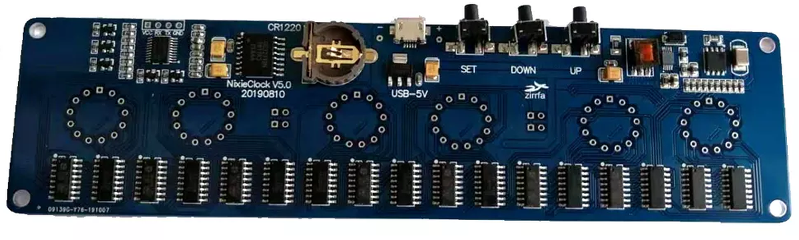
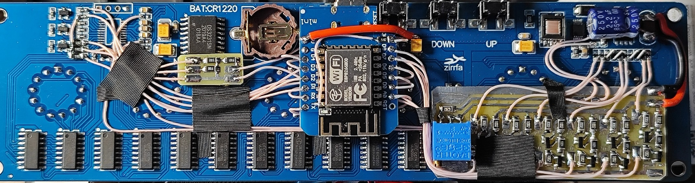
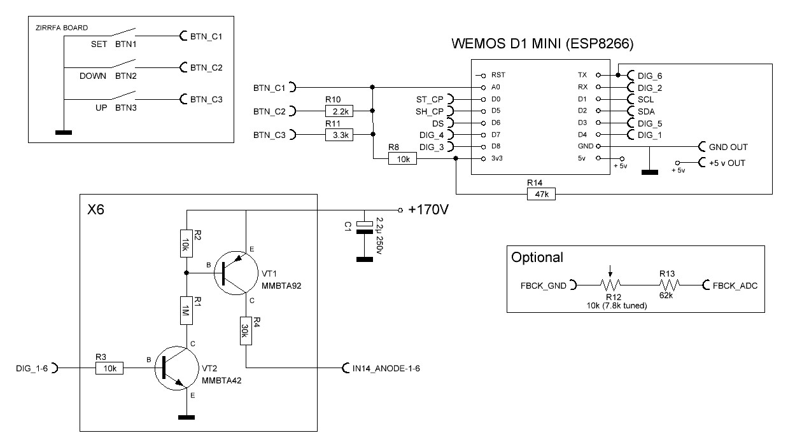
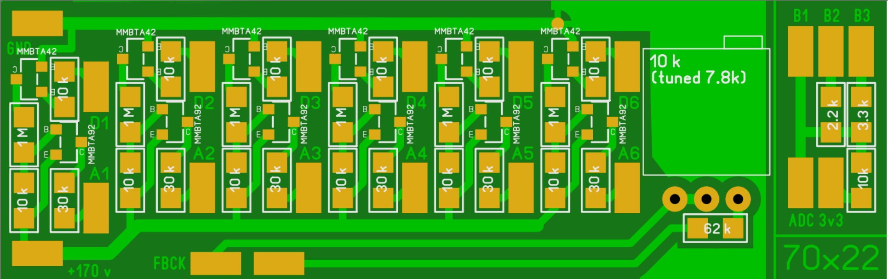

# ESP8266 modification for zirrfa v5.1 IN14 nixie clock board 

Cheap boards "Zirrfa nixie tube DIY kit" for nixie clock [present on aliexpress](https://aliexpress.com/item/1005001889131974.html). This project allows to expand functionality of this board.

**Features**:
*   Automatic time update (via NTP server)
*   Smooth fade in/out for digits
*   ~~Ability to change digits brightness~~ (not implemented)

**Notes**:
*   LEDs under the tubes are disabled (LED backlight with nixie tubes always looks bad)

### Stock board


### Modified board


## Guide

### Firmware
*   Create file `include/secret.h` with code:
    ```
    const char *WIFI_SSID     = "your-wifi-ap-ssid";
    const char *WIFI_PASSWORD = "your-wifi-ap-password";
    ```
*   Configure some values in `Configurable constants` section of `main.cpp` if needed
*   Build and upload project with VScode + PlatformIO to ESP board

### Hardware
**Scheme** 
**PCB** 

*TODO hardware mod guide*
### Parts:
*   ESP board - WeMos D1 mini
*   Zirrfa board v5.1
*   
